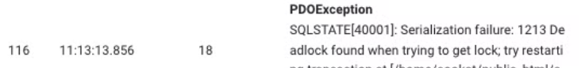
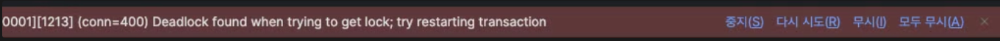
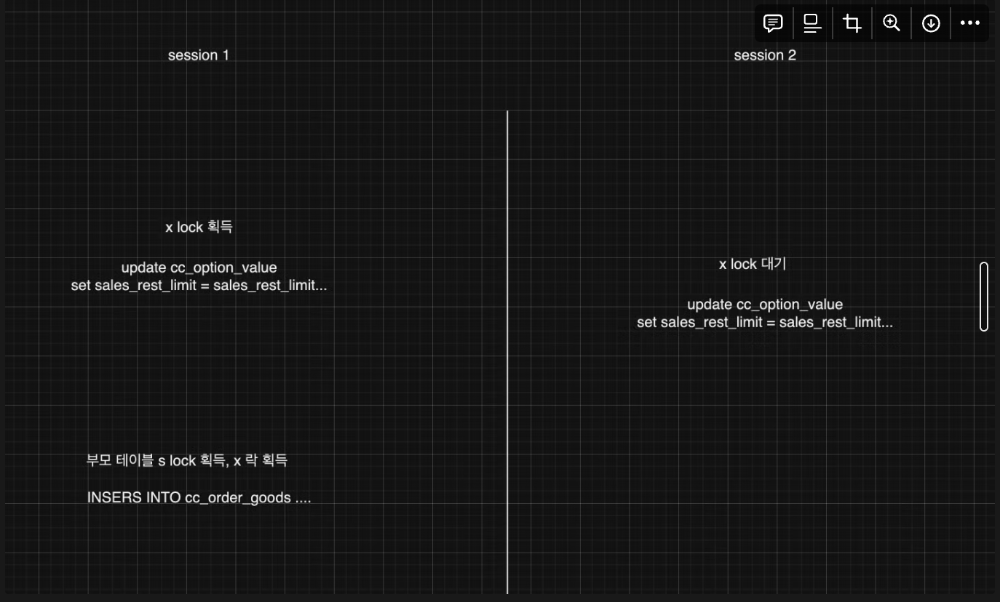

## DeadLock 이슈 원인 파악

---
9일 사내에서 프로모션을 진행하면서, 결제 시 DeadLock을 발생하는 부분을 모니터링 하였습니다.



현재 결제 시 많은 쿼리들이 하나의 트랜잭션으로 묶여져 있는 상황입니다.
문제가 되는 부분은 다음과 같습니다.

1. 결제 시 옵션에 대한 정보 수정
2. 새로운 주문별 제품 저장

이 두가지 UPDATE 와 INSERT 쿼리로 인해서 DeadLock이 발생하고 있습니다.

원인을 해결하기 앞서 X락과 S락에 대한 이해가 필요합니다.
간단히 설명을 진행하면

- S락은 **읽는 동안**에 수정이 발생하지 않게 잠근다.
- X락은 **쓰는 동안**에 수정하지 않도록 잠근다.
- 둘 사이에 크게 다른 점은 없지만, 큰 차이점은 둘 사이에 호환성이라고 합니다.
    - S락은 서로 호환이 되지만, X락은 서로 호환이 되지 않습니다.
- 예를들어, 1번 트랜잭션이 A 레코드에 대해서 S락을 얻었다고 가정합니다.
- 2번 트랜잭션에서 S락을 시도하면 성공합니다.
- 하지만, 2번 트랜잭션에서 X락을 시도하면 대기상태에 빠집니다.
- 1번 트랜잭션이 종료되면 2번 트랜잭션이 수행되게 됩니다.

---

- 위 X락과 S락에 대해서 대충(?) 이해를 했다면, 시스템에서 발생한 Deadlock 현상을 이해할 수 있습니다.
- 문제가 되는 테이블들은 서로 연관관계로 묶여져 있는 테이블입니다.
- 결제 완료 시점에 엄청나게 많은 INSERT와 UPDATE가 이뤄집니다.
- INSERT, UPDATE만 하는데 왜 DeadLock이 발생할 까요?
- Deadlockd은 두 트랜잭션이 하나의 자원을 가지려고 경합하다 일어나는 일인데, 동시에많은 UPDATE가 일어난다고 해도
  Lock Waiting 대기 상태 이후에는 쿼리가 수행해야되는데 바로 Deadlock이 터지는 현상이 발생했습니다.
- 이유는 연관관계 외래키로 묶여있으면서, 이슈가 발생합니다.
- 외래키로 묶여 있는 경우 자식 테이블 (child)이 INSERT를 할 경우 부모 테이블에 레코드가 존재하는지 확인을 한다고 합니다.
- **이때, INSERT 시점에도 S락을 획득하게 됩니다.**

---
### 상황 정리
- A 트랜잭션에서 결제 로직을 수행 시 자식 테이블에서 INSERT를 시도합니다.
- B 트랜잭션도 거의 동시에 결제 완료 로직을 시작합니다.
- B 트랜잭션에서 자식 테이블에 INSERT를 시도합니다. 이때 부모 테이블에 S락을 획득합니다.
- A 트랜잭션에서 자식 테이블의 UPDATE를 시도합니다. 동일한 제품 id에 UPDATE를 해야되는데 이미, B 트랜잭션에서는 해당 로우에 S락을 획득한 상태이기 때문에 대기상태에 빠집니다.
- B 트랜잭션 동일한 id에 UPDATE를 하기 위해 X락을 취득해야 되지만, A 트랜잭션이 COMMIT이 되지 않으면 X락을 획득하지 못하는 경합 상황이 생겨 데드락이 터지고 말았습니다.
---
### 해결
- 해당 이슈를 해결하기 위해 상황을 재현해 보기로 했습니다.
- session을 2개 열고 테스트를 진행했습니다.
- 1번 세션

```sql
BEGIN ;
select sleep(3);

INSERT INTO order (id, option_id, title ....)
VALUES (1, 2, 'test' ....);

UPDATE option
SET quantity = quantity - 1
WHERE option_id = 2;

```

- 2번 세션

```sql
BEGIN ;
select sleep(2);

INSERT INTO order (id, option_id, title ....)
VALUES (1, 2, 'test2' ....);

UPDATE option
SET quantity = quantity - 1
WHERE option_id = 2;
```
- sleep을 건 이유는 동시에 쿼리를 수행하기 위함도 있지만, 실제로 대기 상태에 빠지는지도 확인하고 싶었습니다.
- 1번 세션에서 INSERT가 실행되고 난 이후, UPDATE가 실행될때 
- 
- 위와 같은 데드락이 발생하는 것을 확인했습니다.
- 이와 비슷한 경우의 데드락이 발생한 블로그가 있었습니다.
- 몇 가지 해소 방법이 있었습니다.
  - fk를 없앤다.
  - 트랜잭션을 분리한다.
  - INSERT, UPDATE 문의 순서를 변경한다.
- 일단, FK를 없애는 부분이 부모 테이블의 S락을 획득함으로 발생하는 다른 문제를 예방할 수 있을 것 같고, 퍼포먼스 도 더 좋아질 거라 생각이 들었습니다.
- 두번째 트랜잭션을 분리하는 부분은 하나의 트랜잭션으로 묶이지 않으면 원자성을 보장 할 수 없습니다.
- 세번째 INSERT, UPDATE 문의 순서를 바꾸는 방법이 간단히 해결 할 수 있어 채택하게 되었습니다.

---
### 왜 INSERT 와 UPDATE 순서 변경으로 데드락을 회피할 수 있을까?
- 일단 제일 큰 문제는 INSERT 시 부모 테이블에 S락을 획득으로 인해 두번째 세션과 첫번째 세션에서 하나의 로우를 UPDATE하려고 할때 발생하는 문제입니다.
- 두개의 동일한 id를 UPDATE를 먼저 할 경우에는 S락으로 인한 데드락을 방지할 수 있습니다.

- X락을 획득했던 1번 세션이 X락을 반납하고, 2번 세션에서 X락을 대기 한뒤 획득해서 진행할 수 있습니다.
- 그 다음 INSERT 시에는 S락을 같이 획득할 수 있는 상황이 되므로 1번 세션과 2번 세션은 동일하게 INSERT를 진행 할 수 있게됩니다.

---

### 더 생각해봐야 될 부분
- 결국에, 외래키로 인한 부모 테이블의 S락이 걸리는 문제는 동일하기 때문에, 위의 상황에서는 해소될 수 있지만 다른 부분에서도 비슷한 문제로 인한 deadlock이 발생할 수 있어 추가적으로 모니터링이 필요 할 것 같습니다.
- 위 순서 변경으로 2개의 트랜잭션에 대해서는 해소 할 수 있지만 추가적으로 동일한 option_value 주문이 더 많은 요청이 들어올 제3의 트랜잭션으로 인해 발생할 여지가 있다고 생각이 됩니다.


